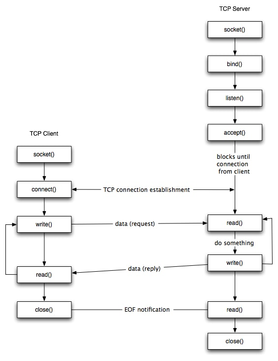

# Podstawowe cechy
## Dziedzina

- `AF_UNIX`/`AF_LOCAL` — komunikacja lokalna w obrębie jednej maszyny
- `AF_INET` — komunikacja internetowa w oparciu o protokół sieciowy IPv4

## Tryb komunikacji

- `SOCK_STREAM` **TCP** — niezawodna, uporządkowana, dwukierunkowa komunikacja strumieniowa oparta o połączenia; podobna w swojej naturze do rozmowy telefonicznej
- `SOCK_DGRAM` **UDP** — zawodna, nieuporządkowana, bezpołączeniowa komunikacja datagramowa; podobna w swojej naturze do przesyłania listów

## Adresy gniazd

### `AF_UNIX`
Wykorzystywana jest struktura `sockaddr_un` zdefiniowana w pliku nagłówkowym `sys/un.h`:

```c
#define UNIX_PATH_MAX    108

struct sockaddr_un {
    sa_family_t sin_family = AF_UNIX;
    char        sun_path[UNIX_PATH_MAX];
}
```

`sun_path` jest ścieżką do pliku który reprezentuje gniazdo, a uprawnienia do niego kontrolują możliwość podłączenia się do socketu.

### `AF_INET`
Wykorzystywana jest struktura `sockaddr_in` zdefiniowana w pliku nagłówkowym `netinet/in.h`:

```c
struct sockaddr_in {
    sa_family_t    sin_family = AF_INET;
    in_port_t      sin_port;  // Numer Portu
    struct in_addr sin_addr;
};

struct in_addr {
    uint32_t       s_addr;
};
```
Do `s_arrr` podajemy wartości:
- `INADDR_ANY` jeśli adres ma opisywać dowolny adres IP posiadany przez maszynę,
- `INADDR_LOOPBACK` jeśli chcemy zezwalać tylko na połączenia lokalne.

## Cykle życia Serwer - Klient

### TCP



### UDP


## Funkcje do zarządzania socketami

Wszystkie poniższe funkcje zostały zdefiniowane w pliku nagłówkowym `sys/socket.h`. Dla zapewnienia przenośności kodu rozsądnie jest również dołączyć plik nagłówkowy `sys/types.h`

### int socket(int domain, int type, int protocol)

Funkcja ta tworzy gniazdo i zwraca numer powiązanego z nim deskryptora albo -1 w przypadku błędu i ustawia errno.

* `domain` — dziedzina,
* `type` — typ komunikacji,
* `protocol` - zazwyczaj 0.

---

### int bind(int sockfd, const struct sockaddr *addr, socklen_t addrlen)

Funkcja ta służy do związania gniazda z jego nazwą (adresem).

W przypadku sukcesu bind(…) zwraca 0, a w przypadku błędu -1 i ustawia errno.

* `sockfd` — numer deskryptora gniazda,
* `addr` — struktura definiująca adres z którym ma zostać związane gniazdo,
* `addrlen` — wynik `sizeof(addr)`.
  
---

### int listen(int sockfd, int backlog)

Funkcja ta odpowiada za rozpoczęcie akceptowania połączeń od klientów.

W przypadku sukcesu listen(…) zwraca 0, a w przypadku błędu -1 i ustawia errno.

* `sockfd` — numer deskryptora gniazda
* `backlog` — maksymalna ilość połączeń które mogą oczekiwać na zaakceptowanie (kolejne połączenia będą od razu odrzucane lub będą całkowicie ignorowane przez system)

---

### int connect(int sockfd, const struct sockaddr *addr, socklen_t addrlen)

Funkcja ta łączy obustronnie klienta z serwerem (TCP).

W przypadku sukcesu connect(…) zwraca 0, a w przypadku błędu -1 i ustawia errno.

* `sockfd` — numer deskryptora gniazda,
* `addr` — struktura definiująca adres z którym ma zostać związane gniazdo,
* `addrlen` — wynik `sizeof(addr)`.

---

### int accept(int sockfd, struct sockaddr *addr, socklen_t *addrlen)

Funkcje te służą do akceptowania oczekujących połączeń na gniazdach połączeniowych. Zazwyczaj stosowana w pętli.

Po wywołaniu zostaje zaakceptowane pierwsze z oczekujących na gnieździe połączeń i zostaje zwrócony deskryptor służący do komunikacji z klientem który się połączył lub -1 i ustawia errno gdy wystąpił błąd.

* `sockfd` — numer deskryptora gniazda,
* `addr` — wskaźnik do miejsca w pamięci przygotowanego do przyjęcia struktury z adresem klienta który się połączył,
* `addrlen` — wynik `sizeof(addr)`.

---

### ssize_t write(int sockfd, const void *buf, size_t len)
### ssize_t sendto(int sockfd, const void *buf, size_t len, int flags, const struct sockaddr *dest_addr, socklen_t addrlen)

Funkcje służą do wysyłania danych z użyciem gniazda. write(...) dla połączenia TCP, sendto(...) dla połączenia UDP. Zazwyczaj w osobnych procesach.
Zwracają ilość wysłanych bajtów lub -1 i ustawiają errno w razie niepowodzenia.

* `sockfd` — numer deskryptora gniazda,
* `buf` — wskaźnik do danych które chcemy wysłać,
* `len` — długość danych w buf które chcemy wysłać,
* `flags` — flagi określające sposób wysyłki danych (zazwyczaj 0),
* `dest_addr` — wskaźnik do struktury opisującej adres odbiorcy danych,
* `addrlen` — wynik `sizeof(dest_addr)`.

---

### ssize_t read(int sockfd, const void *buf, size_t len)
### ssize_t recvfrom(int sockfd, const void *buf, size_t len, int flags, struct sockaddr *src_addr, socklen_t *addrlen)

Służą do odbierania danych z użyciem gniazda. read(...) dla połączenia TCP, recvfrom(...) dla połączenia UDP. Zazwyczaj w osobnych procesach.

Zwracają ilość odebranych bajtów lub -1 i ustawiają errno w razie niepowodzenia. Zwrócenie 0 oznacza że druga strona połączenia zamknęła kanał komunikacji.

* `sockfd` — numer deskryptora gniazda,
* `buf` — wskaźnik do miejsca w pamięci w którym chcemy zapisać dane,
* `len` — maksymalna ilość bajtów które zostaną odczytane z gniazda i zapisane w buf,
* `flags` — flagi określające sposób odbioru danych (zazwyczaj 0),
* `dest_addr` — wskaźnik do struktury opisującej adres wysyłającego dane,
* `addrlen` — wynik `sizeof(dest_addr)`.

---

### int close(int sockfd)

Funkcja ta zamyka deskryptor gniazda. Od tego momentu wszelkie operacje na tym deskryptorze są niedozwolone.

W przypadku sukcesu close(…) zwraca 0, a w przypadku błędu -1 i ustawia errno.

* `sockfd` — numer deskryptora gniazda